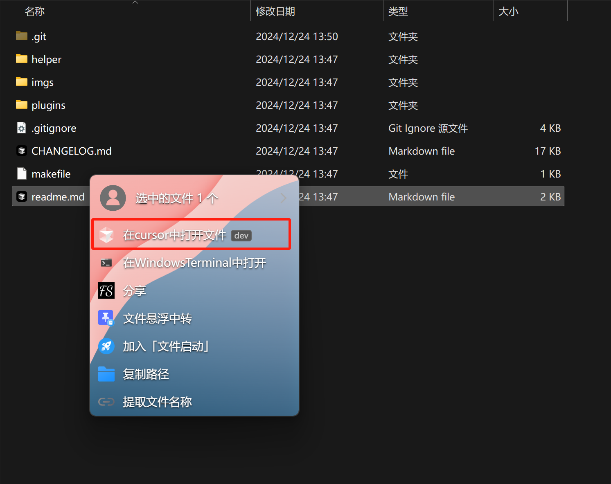
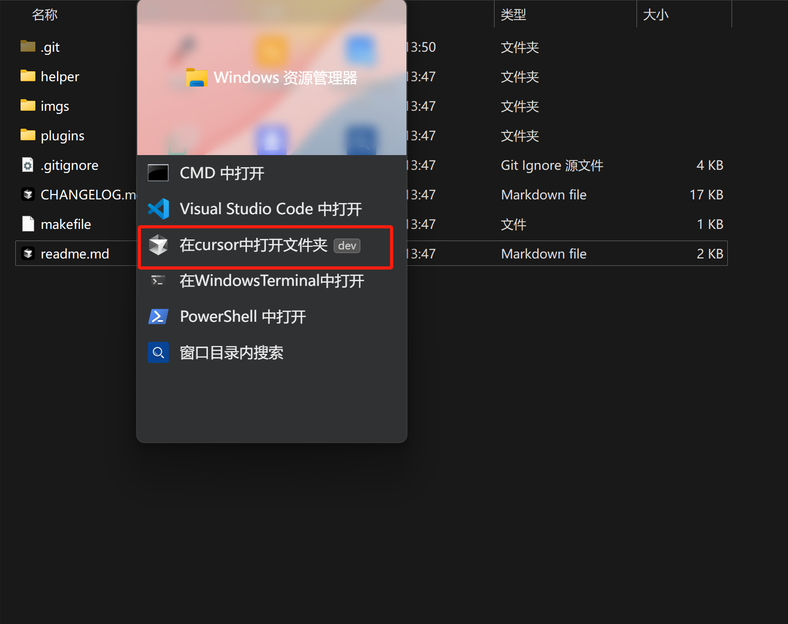
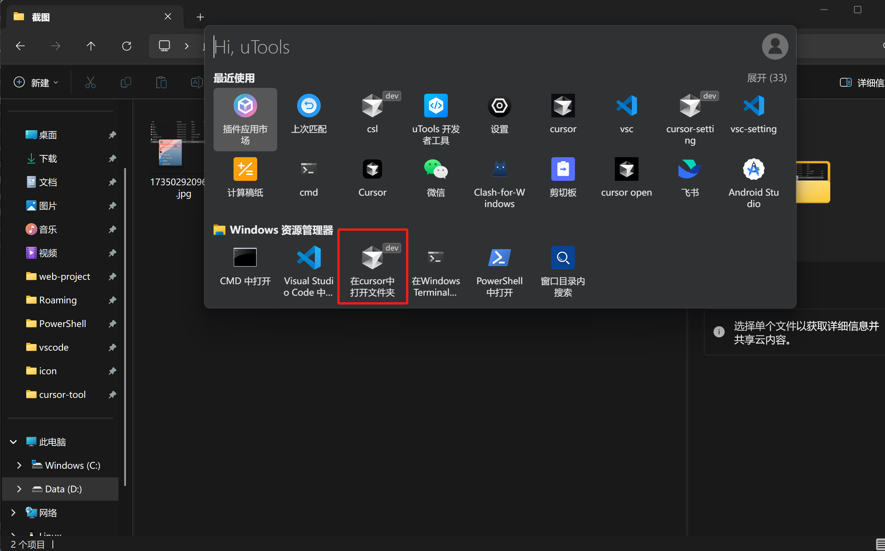
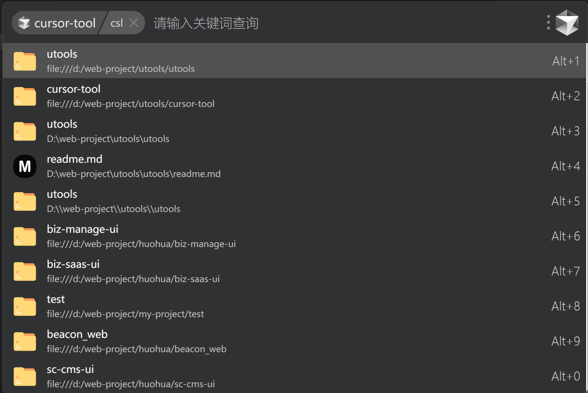
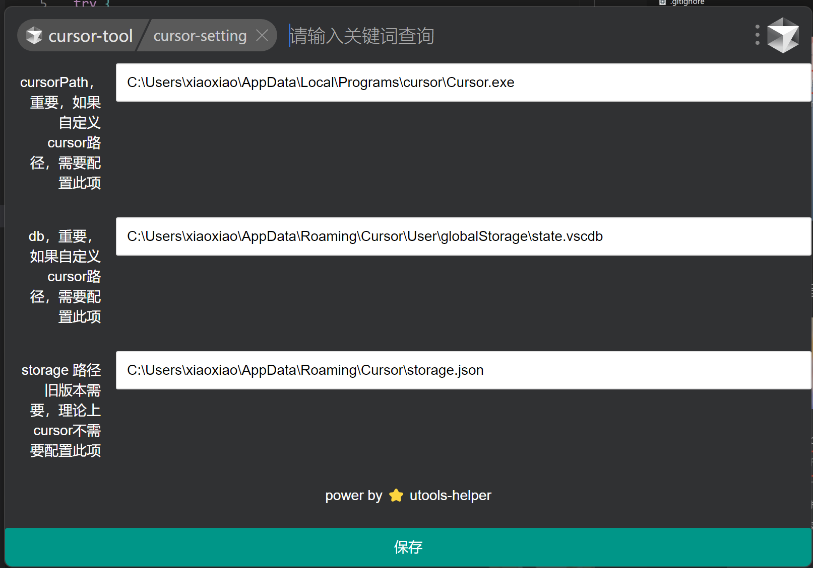

插件修改自 https://github.com/mohuishou/utools

## 文件资源管理器中快速在cursor中打开文件与文件夹
选中文件长按右键打开超级面板打开文件

未选中文件长按右键打开超级面板打开文件夹

## 文件资源管理器中通过utools面板打开文件夹

## 查看历史内容并打开
通过 csl 命令查看历史内容并打开

## 配置cursor
通过 cursor-setting 命令配置cursor

